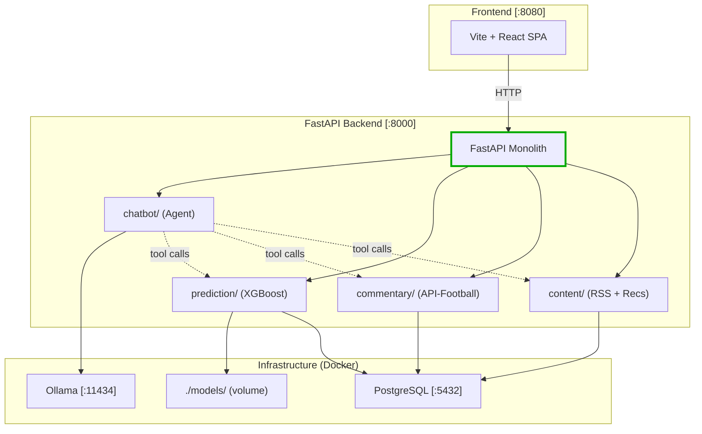

# Real Madrid AI Platform

An AI-powered platform for Real Madrid fans. Combines match prediction, live commentary, personalized news, and an agentic chatbot into a single application running fully local via Docker.

## Architecture




## Features

| Feature | Description |
|---------|-------------|
| **Agent Chatbot** | LLM-powered agent (Ollama/Gemini) that calls prediction, commentary, and news tools to answer fan questions |
| **Match Prediction** | XGBoost model trained on 10 seasons of La Liga data predicting W/D/L probabilities |
| **Live Commentary** | Polls API-Football for live match events, generates human-readable commentary |
| **Personalized News** | RSS-ingested articles categorized by topic with user preference-based recommendations |

## Tech Stack

| Layer | Technology |
|-------|-----------|
| Backend | FastAPI, SQLAlchemy, Alembic |
| Database | PostgreSQL 16 |
| ML | XGBoost, scikit-learn, pandas |
| LLM | Ollama (local, default) / Gemini (optional) |
| Frontend | Vite, React, TypeScript, Tailwind CSS |
| Infrastructure | Docker, docker-compose |

## Quick Start

### Prerequisites

- [Docker](https://docs.docker.com/get-docker/) & Docker Compose
- [Python 3.11+](https://www.python.org/downloads/)
- [Node.js 18+](https://nodejs.org/) (for frontend)

### 1. Clone & Configure

```bash
git clone https://github.com/Caephas/Real_Madrid_AI_Platform.git
cd Real_Madrid_AI_Platform
cp .env.example .env
# Edit .env with your API keys (API_FOOTBALL_KEY, optional GEMINI_API_KEY)
```

### 2. Start Services

```bash
make setup
# Starts PostgreSQL, Ollama, pulls llama3.2 model, starts backend
```

### 3. Start Frontend

```bash
cd frontend && npm install && npm run dev
# Open http://localhost:8080
```

### Local Dev (without Docker for backend)

```bash
docker-compose up -d db ollama     # Start DB + LLM only
pip install -e ".[dev]"            # Install Python deps
uvicorn app.main:app --reload      # Backend with hot reload
```

## Data Pipeline

The ML model is trained offline from historical La Liga data:

```bash
make pipeline
# 1. Scrapes fbref.com for match + shooting stats
# 2. Engineers features (rolling averages, opponent stats, deterministic mappings)
# 3. Trains XGBoost + RandomForest → exports best model to models/
# 4. Updates team_stats table in PostgreSQL
```

After training, restart the backend to load the new model:

```bash
make restart
```

## API Endpoints

| Method | Path | Description |
|--------|------|-------------|
| `POST` | `/chat` | Agent chatbot — processes message, may call tools |
| `POST` | `/predict` | Match prediction — W/D/L probabilities |
| `GET` | `/commentary` | Live match events + commentary (`?team_id=541`) |
| `GET` | `/articles` | List articles (`?category=` `?limit=` filters) |
| `POST` | `/articles/fetch` | Trigger RSS fetch manually |
| `GET` | `/recommendations/{user_id}` | Personalized article list |
| `GET` | `/health` | Backend health check (DB + Ollama) |
| `GET` | `/docs` | Swagger UI |

## Project Structure

```
├── app/                   # FastAPI backend
│   ├── main.py            # App entrypoint + lifespan
│   ├── config.py          # Pydantic Settings
│   ├── database.py        # SQLAlchemy setup
│   ├── models.py          # ORM models
│   ├── chatbot/           # Agent + LLM provider
│   ├── prediction/        # XGBoost model serving
│   ├── commentary/        # API-Football + commentary
│   └── content/           # RSS + recommendations
├── pipeline/              # Offline data pipeline
├── frontend/              # Vite + React SPA
├── migrations/            # Alembic DB migrations
├── models/                # Trained model artifacts
├── data/                  # Raw + processed data
├── tests/                 # pytest test suite
├── docker-compose.yml     # PostgreSQL + Ollama + app
├── Dockerfile             # Multi-stage, non-root
├── Makefile               # Dev workflow commands
└── pyproject.toml         # Python dependencies
```

## Available Make Targets

```bash
make help          # Show all targets
make setup         # First-time setup
make dev           # Local dev (hot reload)
make dev-all       # Full Docker stack
make dev-frontend  # Frontend dev server
make db-migrate    # Run Alembic migrations
make db-reset      # Reset database
make pipeline      # Full data pipeline
make test          # Run tests
make lint          # Lint + format check
make clean         # Stop containers + remove volumes
```

## Documentation

- [System Design](docs/SYSTEM_DESIGN.md) — architecture diagrams, data models, security
- [Development Plan](docs/DEVELOPMENT_PLAN.md) — phased roadmap with deliverables

## License

MIT
