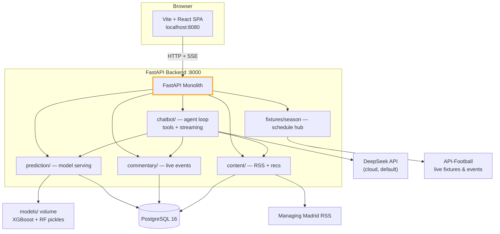
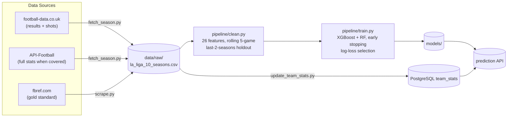

# Real Madrid AI Platform

A news and match-intelligence platform for Real Madrid fans. The core is
**personalized news**, **match predictions**, **live commentary**, and a full
**2026/27 season hub** (fixtures, standings, history, head-to-head). An
agentic chat assistant is included as a companion for quick questions — not
the main event.

The platform is refreshed for the **2026/27 La Liga campaign**: the complete
38-match schedule is bundled, the model is trained through the **2025/26
season**, and predictions now run on DeepSeek with streaming chat.

---

## Features

| Feature | What it does |
|---------|--------------|
| **Personalized News** | RSS-ingested articles categorized by topic, with per-user recommendations |
| **Match Prediction** | XGBoost + Random Forest trained on 8 seasons of La Liga data (incl. xG, possession, shots) → W/D/L probabilities per fixture |
| **Prediction Insights** | Per-match explainability — which stats (opponent xG form, possession, shot volume) are driving the model's lean |
| **Season Hub** | Full 2026/27 fixture list: matchdays, kickoffs, live countdowns, recent results, click-to-predict |
| **Standings & History** | Live league table with last-5 form badges, season-by-season Real Madrid results, and head-to-head records |
| **Call Review** | Paste a YouTube link or upload a clip — the AI reviews the referee's decision frame by frame with visible reasoning |
| **Live Commentary** | Polls API-Football during matches and turns events into readable commentary |
| **Tactical Analysis** | AI narrative comparing both teams' form with key statistical factors |
| **Chat Assistant** | DeepSeek-powered companion with streaming answers — asks the model, checks fixtures/news/live data, and remembers the conversation |

---

## Architecture



### Data pipeline



---

## Tech Stack

| Layer | Technology |
|-------|-----------|
| Backend | FastAPI, SQLAlchemy 2, Alembic, APScheduler |
| LLM | **DeepSeek** (default) · Ollama (local) · Gemini |
| ML | XGBoost, scikit-learn, imbalanced-learn, pandas |
| Database | PostgreSQL 16 |
| Frontend | Vite, React 18, TypeScript, Tailwind, shadcn/ui |
| Infra | Docker / docker-compose |

---

## Quick Start

### Prerequisites

- [Docker](https://www.docker.com/) + Docker Compose
- Python 3.11+
- Node.js 18+ (for the frontend)
- A [DeepSeek API key](https://platform.deepseek.com/) and an
  [API-Football key](https://www.api-football.com/) (optional but recommended)

### 1. Configure

```bash
git clone https://github.com/Caephas/Real_Madrid_AI_Platform.git
cd Real_Madrid_AI_Platform
cp .env.example .env
```

Then edit `.env`:

```env
LLM_PROVIDER=deepseek
DEEPSEEK_API_KEY=sk-...
API_FOOTBALL_KEY=...
```

### 2. Start the backend

```bash
make setup        # starts PostgreSQL, runs migrations, installs deps
make dev          # uvicorn with hot reload on :8000
```

### 3. Start the frontend

```bash
cd frontend
npm install
npm run dev       # open http://localhost:8080
```

The Vite dev server proxies API calls to the backend, so no extra
configuration is needed. The app is available at **http://localhost:8080**
once running.

---

## API Reference

All endpoints are served from `http://localhost:8000` (Swagger UI at `/docs`).

| Method | Path | Description |
|--------|------|-------------|
| `POST` | `/chat` | Agentic chatbot with conversation memory |
| `POST` | `/chat/stream` | Same agent over **SSE** — token deltas + tool events |
| `GET` | `/conversations/{id}` | Message history for a thread |
| `POST` | `/predict` | W/D/L probabilities for a fixture |
| `POST` | `/predict/analysis` | Prediction + AI tactical narrative + form comparison |
| `GET` | `/standings` | League table (position, W/D/L, points, form) for a season |
| `GET` | `/form` | Recent results (W/D/L) for any team |
| `GET` | `/history` | Real Madrid's matches for a season |
| `GET` | `/h2h` | Head-to-head record vs an opponent |
| `POST` | `/calls/analyze` | Start a Call Review job (YouTube URL or video upload) |
| `GET` | `/calls/{id}` | Poll a Call Review job (status, verdict, reasoning, frames) |
| `GET` | `/next-match` | Next upcoming fixture |
| `GET` | `/fixtures` | Remaining fixtures |
| `GET` | `/season` | Full season info: fixtures, statuses, results |
| `GET` | `/results` | Recent finished matches with scores |
| `GET` | `/commentary` | Live match events + commentary (`?team_id=541`) |
| `GET` | `/articles` | Articles (`?category=` `?limit=`) |
| `POST` | `/articles/fetch` | Trigger RSS ingestion |
| `GET` | `/recommendations/{user_id}` | Personalized article list |
| `GET` | `/health` | DB + LLM connectivity |

---

## Data Pipeline

Run the full loop with:

```bash
make pipeline
```

### Step 1 — Collect data

Three sources, chosen automatically:

1. **`pipeline/fetch_season.py`** — downloads a complete season from
   **football-data.co.uk** (works everywhere, no key). Advanced stats it lacks
   (xG, possession, shot distance, FK goals, penalties) are filled with
   league-average priors from the historical dataset.
2. **`pipeline/scrape.py`** — full-fidelity **fbref** scraping (real xG,
   possession, shooting). Resumable via per-team checkpoints; needs a network
   fbref allows.
3. **API-Football** — used when a season isn't covered by the other sources.

```bash
# Pull the 2025/26 season and merge it into the raw dataset
python3 -m pipeline.fetch_season --season 2526 --merge

# Full-fidelity scrape from fbref (from a non-blocked network)
python3 -m pipeline.scrape --output data/raw/
```

### Step 2 — Feature engineering

`pipeline/clean.py` turns raw matches into a **26-feature** dataset:

- 4 basic features: venue, opponent code, kickoff hour, day of week
- **11 five-game rolling averages** (closed-left, no leakage): goals for/against,
  shots, shots on target, shot distance, FK goals, penalties, xG, xGA, possession
- 11 opponent rolling averages, merged on the same match date
- Temporal split: the **last 2 seasons** are held out as test

### Step 3 — Train

`pipeline/train.py` trains XGBoost (with early stopping) and Random Forest,
applies SMOTE for class imbalance, evaluates **Platt calibration** (auto-deploys
it only when it actually lowers log loss), and selects the best model by
**log loss** (better than accuracy for probability outputs). Artifacts:

```
models/
├── xgboost_model.pkl        # gradient boosting
├── rf_model.pkl             # random forest (default at inference)
├── model_metrics.json       # accuracy, log loss, CV, class reports
├── feature_importance.json  # ranked feature importances
├── feature_stats.json       # per-feature mean/std (prediction insights)
└── *_mapping.json           # deterministic name → code mappings
```

### Step 4 — Sync live stats

```bash
python3 -m pipeline.update_team_stats --input data/raw/la_liga_10_seasons.csv
make restart                  # load the new model into the running app
```

`make refresh` does the same for the current season and runs automatically
every 24h while the app is up.

---

## Fixtures

- The **2026/27 schedule** (all 38 matchdays) ships in
  [`app/fixtures_2026_27.json`](app/fixtures_2026_27.json).
- When `API_FOOTBALL_KEY` is set, live kickoff dates/venues override the
  static entries (6h cache).
- To correct a date without rebuilding, drop an override file at
  `data/fixtures_2026_27.json` (same JSON format).

---

## Project Structure

```
├── app/                      # FastAPI backend
│   ├── main.py               # entrypoint + lifespan (scheduler)
│   ├── config.py             # Pydantic settings
│   ├── models.py             # SQLAlchemy models
│   ├── chatbot/              # agent loop + DeepSeek/Ollama/Gemini providers
│   ├── prediction/           # feature builder + model serving
│   ├── commentary/           # API-Football client + commentary generator
│   ├── content/              # RSS ingestion + recommendations
│   └── fixtures.py           # season schedule + API enrichment
├── pipeline/                 # scrape / fetch_season / clean / train / stats
├── frontend/                 # Vite + React SPA
├── migrations/               # Alembic migrations
├── models/                   # trained artifacts (gitignored)
├── data/                     # raw + processed datasets (gitignored)
├── tests/                    # pytest suite
├── docs/                     # SYSTEM_DESIGN.md, ml_pipeline.md
└── Makefile                  # dev workflow
```

---

## Testing & Quality

```bash
make test      # 71 pytest tests (backend + pipeline)
make lint      # ruff + black
cd frontend && npm run lint && npm test   # frontend lint + vitest
```

Pushes to `main` run a **GitHub Actions CI** workflow: pytest + ruff + black
on the backend, lint + build + vitest on the frontend.

## Docker (full stack)

```bash
docker compose up --build
```

This runs PostgreSQL, the backend, **and the frontend behind nginx**
(http://localhost:8080) — no Node needed on the host.

---

## Troubleshooting

| Problem | Fix |
|---------|-----|
| fbref returns 403 | fbref blocks some networks. `make refresh` now falls back to football-data.co.uk automatically — or use `python3 -m pipeline.fetch_season --season 2526 --merge` directly |
| No chat answers | Check `GET /health` — `llm` should say `connected`. Verify `DEEPSEEK_API_KEY` in `.env` |
| Call Review says vision isn't configured | Add a `GEMINI_API_KEY` (free at Google AI Studio) — DeepSeek's API is text-only, so frame analysis runs through Gemini |
| Predictions fail with "no rolling stats" | Run `make refresh` or `update_team_stats` to populate `team_stats` |
| Wrong fixture dates | API-Football overrides the static schedule when the key is set; add `data/fixtures_2026_27.json` to correct dates manually |

---

## Documentation

- [System Design](docs/SYSTEM_DESIGN.md) — architecture, data model, deployment
- [ML Pipeline](docs/ml_pipeline.md) — end-to-end data + training walkthrough

## License

MIT
