# Real Madrid AI Platform — Development Plan

> Phased roadmap from current state to complete local application.
> Each phase has a clear deliverable, verification step, and list of files touched.

---

## Current State Inventory

### Salvageable Logic (extract and adapt)

| Source File | What to Reuse | Adapts Into |
|------------|---------------|-------------|
| `services/performance_prediction/processing/scrape_data.py` | fbref.com scraping logic, URL traversal, shooting stats merge | `pipeline/scrape.py` |
| `services/performance_prediction/processing/eda_and_clean.py` | Rolling average function, feature engineering pipeline | `pipeline/clean.py` |
| `services/performance_prediction/training/train_entry.py` | RF training, SMOTE, evaluation, classification report | `pipeline/train.py` |
| `services/performance_prediction/scripts/split_data.py` | Date-based split, opponent merge, rolling avg calculation | `pipeline/clean.py` |
| `services/match_commentary/utils/api_football.py` | API-Football fetch, team filtering | `app/commentary/api_football.py` |
| `services/match_commentary/utils/commentary.py` | Event-to-text templates (3 event types) | `app/commentary/generator.py` |
| `services/personalized_content/utils/fetch_and_store_articles.py` | RSS parsing, article field extraction | `app/content/rss.py` |
| `services/personalized_content/api/recommendations_api.py` | Preference-based filtering, sort by date | `app/content/router.py` |
| `data/*.csv` | Training data | Keep in `data/` |
### Delete Entirely

| Path | Reason |
|------|--------|
| `services/` | Entire directory. All logic extracted into `app/` and `pipeline/`. |
| `infra/` | All Terraform. Replaced by `docker-compose.yml`. |
| `notebooks/` | EDA notebooks. Stale, not part of the app. |
| `services/performance_prediction/training/train_dnn.py` | LSTM model — dropped per decision. |
| `services/performance_prediction/scripts/run_training_job.py` | SageMaker launcher — no longer needed. |
| `services/performance_prediction/scripts/run_dnn_training_job.py` | SageMaker DNN launcher — dropped. |
| `services/performance_prediction/training/sagemaker_serving.py` | SageMaker inference — replaced by local model.py. |
| `services/performance_prediction/training/inference.py` | SageMaker proxy import — dead code. |
| Root `pyproject.toml` | Bloated (30+ deps). Replaced with slim version. |
| `logo.png` | Move to `frontend/public/` if needed, delete from root. |

| `data/real_madrid_facts.jsonl` | No longer needed (RAG dropped, no system prompt grounding) |

### Keep As-Is

| Path | Reason |
|------|--------|
| `data/*.csv` | Training data files |
| `.gitignore` | Update, don't delete |
| `docs/SYSTEM_DESIGN.md` | Just created |

---

## Phase 1: Teardown + Foundation

**Goal**: Clean repo, scaffold the new project, get `docker-compose up` to produce a running FastAPI app connected to PostgreSQL and Ollama.

### 1.1 Delete Old Code

```bash
rm -rf services/
rm -rf infra/
rm -rf notebooks/
rm pyproject.toml
rm logo.png
```

### 1.2 Create Project Files

| File | Description |
|------|-------------|
| `pyproject.toml` | Slim dependencies (~15 packages) |
| `Dockerfile` | Multi-stage, python:3.11-slim, non-root user |
| `docker-compose.yml` | 3 services: `db`, `ollama`, `app` |
| `.env.example` | All env vars documented |
| `.gitignore` | Updated (add `models/*.pkl`, `__pycache__`, `.env`) |
| `Makefile` | Targets: `setup`, `dev`, `test`, `pipeline`, `clean` |

### 1.3 FastAPI Scaffold

| File | Description |
|------|-------------|
| `app/__init__.py` | Empty |
| `app/main.py` | FastAPI app, `GET /health`, lifespan stub |
| `app/config.py` | Pydantic Settings (DATABASE_URL, LLM_PROVIDER, etc.) |
| `app/database.py` | SQLAlchemy engine, SessionLocal, `get_db()` |
| `app/models.py` | ORM: `MatchEvent`, `Article`, `User`, `TeamStats` |
| `app/middleware.py` | CORS, structured JSON logging |
| `alembic.ini` | Alembic config pointing to DATABASE_URL |
| `migrations/env.py` | Alembic env importing `app.models.Base` |

### Verification

```bash
docker-compose up -d
curl http://localhost:8000/health
# → {"status": "ok", "db": "connected", "ollama": "connected"}
```

**Deliverable**: Running containers. `/health` returns 200 with DB and Ollama connectivity confirmed.

---

## Phase 2: Data Pipeline

**Goal**: Produce a trained XGBoost model + mappings + team_stats in PostgreSQL from raw data. All runnable via `make pipeline`.

### 2.1 Scraper

| File | Source |
|------|--------|
| `pipeline/__init__.py` | New (empty) |
| `pipeline/scrape.py` | Adapt from `services/performance_prediction/processing/scrape_data.py`. Add: retry with backoff, progress logging, configurable season range. |

### 2.2 Cleaning + Feature Engineering

| File | Source |
|------|--------|
| `pipeline/clean.py` | Merge logic from `eda_and_clean.py` + `split_data.py`. Single script: load raw CSV → venue/opp codes → rolling averages → opponent merge → date-based split → save train/test CSVs. Also save `opponent_mapping.json` and `venue_mapping.json`. |

### 2.3 Model Training

| File | Source |
|------|--------|
| `pipeline/train.py` | Adapt from `train_entry.py`. Strip SageMaker args. Add: XGBoost training alongside RF, comparison table output, export `xgboost_model.pkl` + `rf_model.pkl` + mappings to `models/`. |

### 2.4 Team Stats Update

| File | Source |
|------|--------|
| `pipeline/update_team_stats.py` | New. Reads latest processed data, computes per-team rolling averages, upserts into PostgreSQL `team_stats` table. |

### Verification

```bash
make pipeline
# Outputs:
#   data/processed/cleaned_laliga.csv
#   data/processed/train.csv, test.csv
#   models/xgboost_model.pkl
#   models/opponent_mapping.json, venue_mapping.json
#   PostgreSQL team_stats table populated

python -c "import joblib; m = joblib.load('models/xgboost_model.pkl'); print(m)"
```

**Deliverable**: Trained model on filesystem. Mappings exported. `team_stats` table populated.

---

## Phase 3: Prediction Module

**Goal**: `POST /predict` returns Win/Draw/Loss probabilities.

| File | Description |
|------|-------------|
| `app/prediction/__init__.py` | Empty |
| `app/prediction/router.py` | `POST /predict` — accepts `{opponent, venue, date}`, returns probabilities |
| `app/prediction/model.py` | Load `xgboost_model.pkl` from `MODEL_DIR` at startup, cache in memory |
| `app/prediction/features.py` | Build 20-feature vector: lookup `team_stats` from PostgreSQL, map opponent via JSON |
| `app/prediction/mappings.py` | Load + cache `opponent_mapping.json`, `venue_mapping.json` from `MODEL_DIR` |

### Verification

```bash
docker-compose restart app

curl -X POST http://localhost:8000/predict \
  -H "Content-Type: application/json" \
  -d '{"opponent": "Barcelona", "venue": "home", "date": "2025-04-13"}'
# → {"win": 0.58, "draw": 0.27, "loss": 0.15}
```

**Deliverable**: Working prediction endpoint returning real probabilities from the trained model.

---

## Phase 4: Content Module

**Goal**: RSS articles ingested on a schedule, served via API, filterable by category, with user preference-based recommendations.

| File | Source |
|------|--------|
| `app/content/__init__.py` | Empty |
| `app/content/router.py` | Adapt from `recommendations_api.py`. Endpoints: `GET /articles`, `GET /recommendations/{user_id}`. SQL queries replace DynamoDB scans. |
| `app/content/rss.py` | Adapt from `fetch_and_store_articles.py`. Drop spaCy, keep keyword categorization. Remove module-level execution. Called by APScheduler. |
| `app/content/crud.py` | New. SQLAlchemy queries: insert article (upsert on article_id), get by category, get user preferences. |

Add APScheduler startup in `app/main.py` lifespan to run `rss.fetch_and_store()` every 6 hours.

### Verification

```bash
# Trigger manual fetch
curl -X POST http://localhost:8000/articles/fetch

# Check articles stored
curl http://localhost:8000/articles
curl http://localhost:8000/articles?category=Transfers

# Check recommendations (after seeding a test user)
curl http://localhost:8000/recommendations/test-user-1
```

**Deliverable**: Articles ingested from RSS, categorized, stored in PostgreSQL, queryable. Scheduler running.

---

## Phase 5: Commentary Module

**Goal**: `GET /commentary/{team_id}` returns live match events with generated commentary text.

| File | Source |
|------|--------|
| `app/commentary/__init__.py` | Empty |
| `app/commentary/router.py` | New. `GET /commentary/{team_id}` — fetches live events, generates commentary, stores in DB, returns both. |
| `app/commentary/api_football.py` | Adapt from `utils/api_football.py`. Add: `httpx` async client, retry with backoff, configurable timeout, proper error handling. |
| `app/commentary/generator.py` | Adapt from `utils/commentary.py`. Expand beyond 3 event types. Add: VAR, penalty, injury, halftime, fulltime. |

### Verification

```bash
# During a live match (or mock):
curl http://localhost:8000/commentary/541
# → {"team_id": 541, "match_status": "1H", "events": [...]}

# No live match:
curl http://localhost:8000/commentary/541
# → {"message": "No live matches found for this team."}
```

**Deliverable**: Commentary endpoint functional with expanded event coverage.

---

## Phase 6: Agent Chatbot

**Goal**: `POST /chat` runs a tool-calling agent that can invoke prediction, commentary, and content modules.

| File | Description |
|------|-------------|
| `app/chatbot/__init__.py` | Empty |
| `app/chatbot/router.py` | `POST /chat` — instantiates agent, runs loop, returns response |
| `app/chatbot/llm_provider.py` | `LLMProvider` Protocol. `OllamaProvider` (httpx to ollama:11434). `GeminiProvider` (google-generativeai). Factory from env var. |
| `app/chatbot/agent.py` | Tool-calling loop. Send messages + tool schemas → LLM → execute tool calls → feed results back → repeat until final text. Max 5 iterations. |
| `app/chatbot/tools.py` | 4 tools: `predict_match`, `get_live_commentary`, `get_articles`, `get_team_stats`. Each calls the corresponding module's core function directly (no HTTP). |

### Verification

```bash
# Simple question (no tools needed)
curl -X POST http://localhost:8000/chat \
  -d '{"prompt": "Who is the best Real Madrid player?"}'
# → {"response": "...", "tools_used": []}

# Question that triggers tools
curl -X POST http://localhost:8000/chat \
  -d '{"prompt": "What are our chances against Atletico this weekend?"}'
# → {"response": "Based on the prediction model, ...", "tools_used": ["predict_match"]}

# Multi-tool question
curl -X POST http://localhost:8000/chat \
  -d '{"prompt": "Give me a match preview for the next game and any relevant news"}'
# → {"response": "...", "tools_used": ["predict_match", "get_articles"]}
```

**Deliverable**: Agent chatbot that autonomously decides which tools to call and synthesizes responses.

---

## Phase 7: Tests

**Goal**: Test coverage for all modules. CI-ready.

| File | Tests |
|------|-------|
| `tests/conftest.py` | Fixtures: test PostgreSQL (docker), mock Ollama responses, test model file |
| `tests/test_prediction.py` | Model loading, feature construction, mapping lookup, endpoint response shape |
| `tests/test_content.py` | RSS parsing, article upsert, category filtering, recommendation logic |
| `tests/test_commentary.py` | Event parsing, all event types, commentary text generation |
| `tests/test_chatbot.py` | Agent loop with mocked LLM (returning tool calls), tool execution, max iteration bound |
| `tests/test_pipeline.py` | Clean function output shape, rolling average correctness, mapping export |

### Verification

```bash
make test
# pytest tests/ -v --tb=short
# All green
```

**Deliverable**: Full test suite passing.

---

## Phase 8: Frontend

**Goal**: React SPA with 4 pages: Dashboard, Chat, Live Match, News.

| File | Description |
|------|-------------|
| `frontend/package.json` | Vite + React + React Router |
| `frontend/Dockerfile` | Node alpine, serve built assets or dev server |
| `frontend/src/App.jsx` | Router: `/`, `/chat`, `/live`, `/news` |
| `frontend/src/pages/Dashboard.jsx` | Cards: next prediction, latest articles, match status |
| `frontend/src/pages/Chat.jsx` | Chat interface, message history, typing indicator |
| `frontend/src/pages/LiveMatch.jsx` | Commentary feed, auto-poll every 30s |
| `frontend/src/pages/News.jsx` | Article list, category filter tabs |
| `frontend/src/api/client.js` | Fetch wrapper for all backend endpoints |
| `frontend/src/index.css` | Design system, dark theme |

### Verification

```bash
docker-compose up
# Open http://localhost:5173
# Navigate all 4 pages
# Send a chat message → see agent response with tool indicators
# Check prediction card → see W/D/L probabilities
```

**Deliverable**: Working frontend connected to all backend endpoints.

---

## Phase 9: Polish

**Goal**: Production-grade finishing touches.

| Task | Description |
|------|-------------|
| `README.md` | Full rewrite: architecture diagram, setup instructions, screenshots |
| Error handling | Consistent error response schema across all endpoints |
| Health check | `GET /health` verifies DB, Ollama, model loaded, scheduler running |
| Logging | Structured JSON logs with request ID correlation |
| `.gitignore` | Final pass: `models/*.pkl`, `.env`, `__pycache__`, `pgdata`, etc. |
| `Makefile` | Final targets: `setup`, `dev`, `test`, `pipeline`, `lint`, `clean` |

---

## Execution Order & Dependencies

```mermaid
gantt
    title Development Phases
    dateFormat X
    axisFormat %s

    section Foundation
    Phase 1 Teardown + Scaffold    :p1, 0, 3
    
    section Data
    Phase 2 Pipeline               :p2, after p1, 3
    
    section Backend Modules
    Phase 3 Prediction             :p3, after p2, 2
    Phase 4 Content                :p4, after p1, 2
    Phase 5 Commentary             :p5, after p1, 2
    Phase 6 Agent Chatbot          :p6, after p3, 3
    
    section Quality
    Phase 7 Tests                  :p7, after p6, 2
    
    section UI
    Phase 8 Frontend               :p8, after p6, 4
    
    section Final
    Phase 9 Polish                 :p9, after p8, 1
```



> Phases 4 and 5 can run in parallel with Phase 2 since they don't depend on the trained model.
> Phase 6 (Agent) depends on Phases 3, 4, and 5 because it calls them as tools.
> Phase 8 (Frontend) can start after Phase 6 since it needs all endpoints available.
