# Real Madrid AI Platform — System Design

## 1. System Context

An AI-powered platform for Real Madrid fans. Four capabilities: agentic chatbot, match outcome prediction, live commentary, and personalized news. Runs **fully local** via Docker containers — zero cloud dependency.

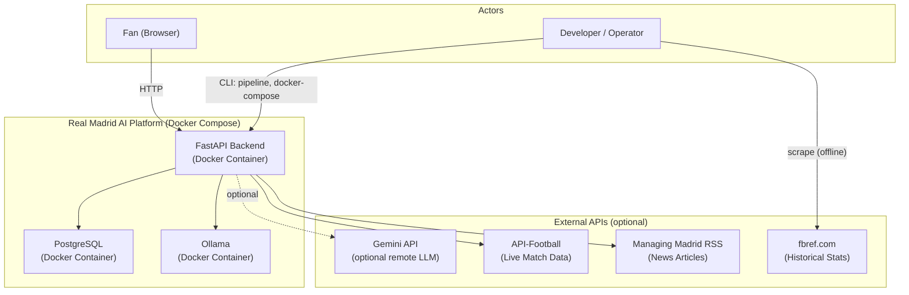

---

## 2. Container Diagram

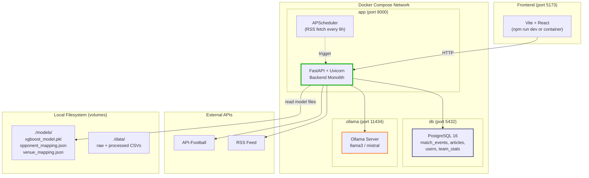

### Cost: **$0/mo** (runs on your machine)

---

## 3. Component Diagram (Backend)

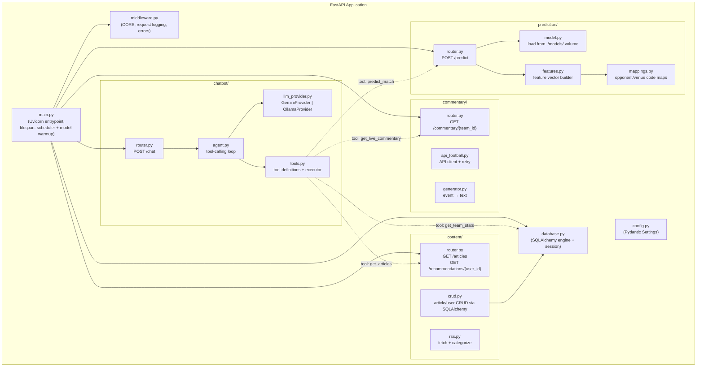

---

## 4. Agent Architecture

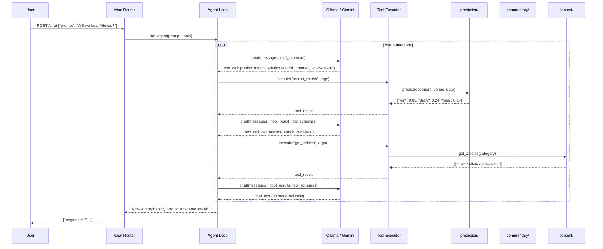

---

## 5. LLM Provider Swap

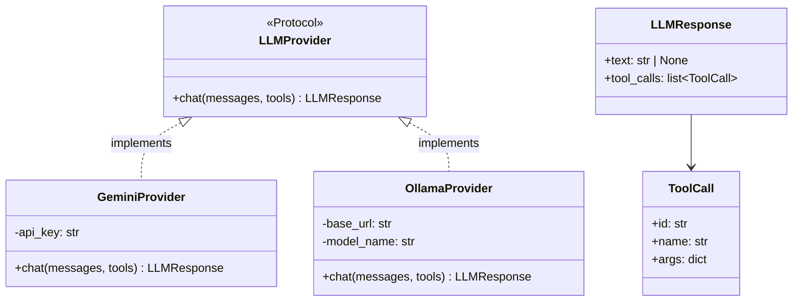

```
LLM_PROVIDER=ollama  →  OllamaProvider(base_url="http://ollama:11434", model="llama3")
LLM_PROVIDER=gemini  →  GeminiProvider(api_key=GEMINI_API_KEY)
```

Default: **Ollama** (fully local, no API key required).

---

## 6. Data Pipeline

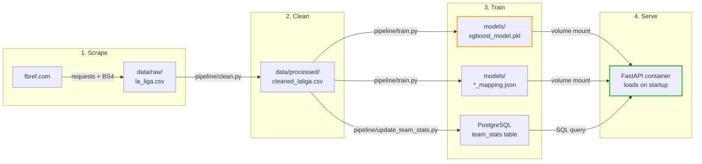

No S3 upload step. Model files are mounted directly into the container via Docker volumes.

---

## 7. API Design

| Method | Path | Module | Description |
|--------|------|--------|-------------|
| `POST` | `/chat` | chatbot | Agent processes prompt, may call tools |
| `POST` | `/predict` | prediction | W/D/L probabilities for a match |
| `GET` | `/commentary/{team_id}` | commentary | Live events + generated commentary |
| `GET` | `/articles` | content | List articles, optional `?category=` |
| `GET` | `/recommendations/{user_id}` | content | Personalized articles |
| `GET` | `/health` | root | Health check (DB + Ollama connectivity) |

### Request/Response Schemas

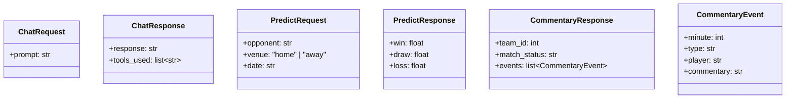

---

## 8. Data Model (PostgreSQL)

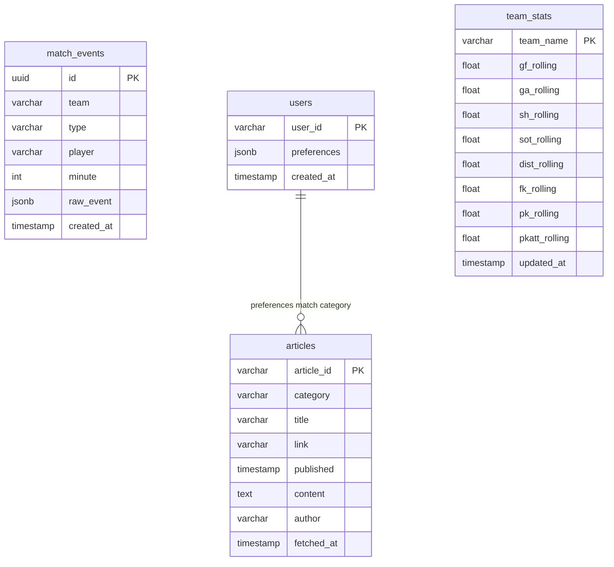

### Indexes

| Table | Index | Purpose |
|-------|-------|---------|
| `articles` | `ix_articles_category` | Filter by category |
| `articles` | `ix_articles_published` | Sort by recency |
| `match_events` | `ix_events_team` | Filter by team |
| `team_stats` | PK on `team_name` | Feature lookup at inference |

---

## 9. Docker Compose Architecture

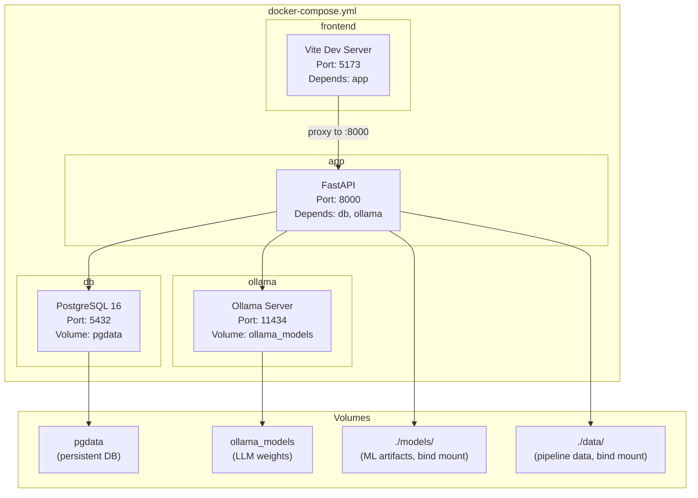

```yaml
# docker-compose.yml (conceptual)
services:
  db:
    image: postgres:16-alpine
    environment:
      POSTGRES_DB: real_madrid
      POSTGRES_USER: rmadmin
      POSTGRES_PASSWORD: ${DB_PASSWORD}
    volumes:
      - pgdata:/var/lib/postgresql/data
    ports:
      - "5432:5432"

  ollama:
    image: ollama/ollama:latest
    volumes:
      - ollama_models:/root/.ollama
    ports:
      - "11434:11434"

  app:
    build: .
    environment:
      DATABASE_URL: postgresql://rmadmin:${DB_PASSWORD}@db:5432/real_madrid
      LLM_PROVIDER: ollama
      OLLAMA_BASE_URL: http://ollama:11434
      MODEL_DIR: /app/models
    volumes:
      - ./models:/app/models:ro
      - ./data:/app/data:ro
    ports:
      - "8000:8000"
    depends_on:
      - db
      - ollama

  frontend:
    build: ./frontend
    ports:
      - "5173:5173"
    depends_on:
      - app

volumes:
  pgdata:
  ollama_models:
```

---

## 10. Startup & Initialization

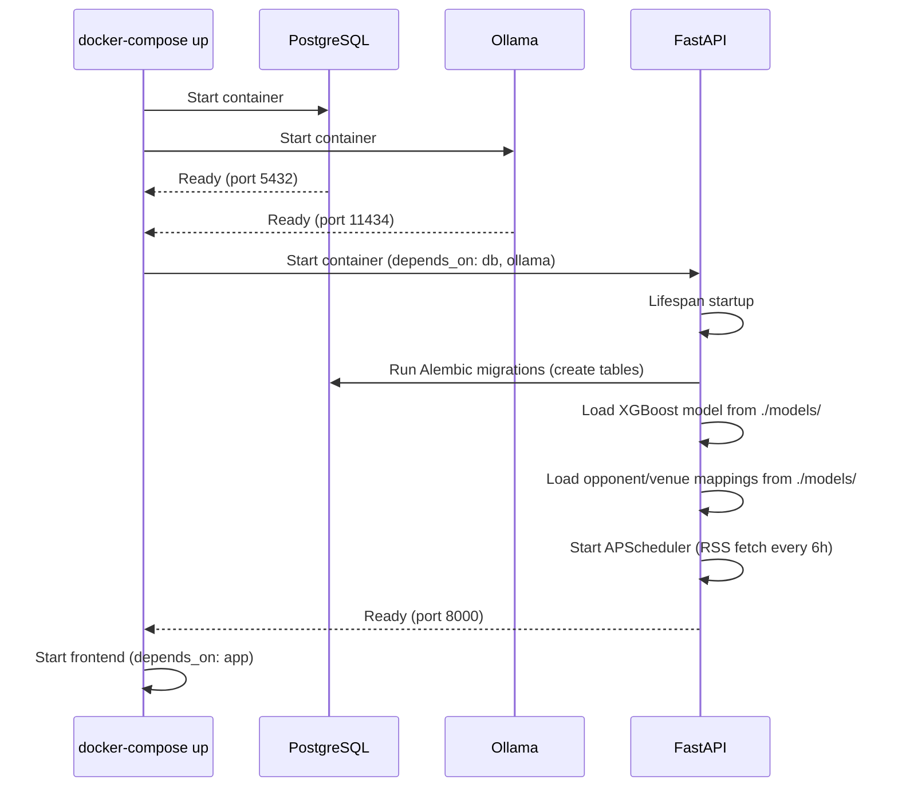

---

## 11. Model Serving (Local)

```python
# No S3. No boto3. Just filesystem.
import joblib
from pathlib import Path

_model = None

def get_model(model_dir: str = "/app/models") -> object:
    global _model
    if _model is None:
        path = Path(model_dir) / "xgboost_model.pkl"
        _model = joblib.load(path)
    return _model
```

Model is loaded **once** at startup via FastAPI lifespan, cached in-process. No cold starts, no S3 downloads. Docker volume mount makes `./models/` available at `/app/models` inside the container.

---

## 12. Deployment Flow

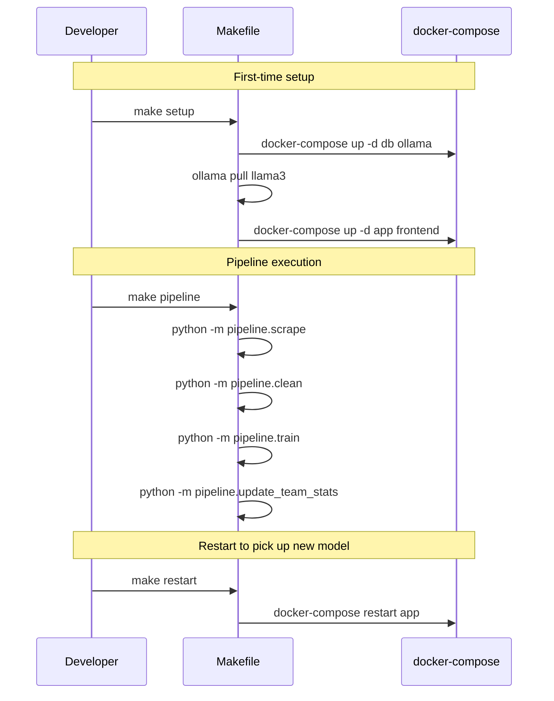

---

## 13. Project Structure (Updated)

```
Real_Madrid_AI_Platform/
├── app/
│   ├── __init__.py
│   ├── main.py               # Uvicorn entrypoint, lifespan, scheduler
│   ├── config.py              # Pydantic Settings (DATABASE_URL, LLM_PROVIDER, etc.)
│   ├── database.py            # SQLAlchemy engine, session, Base
│   ├── models.py              # SQLAlchemy ORM models (all tables)
│   ├── middleware.py           # CORS, structured logging
│   ├── chatbot/
│   │   ├── router.py
│   │   ├── agent.py
│   │   ├── llm_provider.py
│   │   └── tools.py
│   ├── prediction/
│   │   ├── router.py
│   │   ├── model.py           # Load from filesystem, no S3
│   │   ├── features.py
│   │   └── mappings.py
│   ├── commentary/
│   │   ├── router.py
│   │   ├── api_football.py
│   │   └── generator.py
│   └── content/
│       ├── router.py
│       ├── rss.py
│       └── crud.py            # SQLAlchemy queries
├── pipeline/
│   ├── scrape.py
│   ├── clean.py
│   ├── train.py
│   └── update_team_stats.py
├── migrations/                 # Alembic
│   ├── env.py
│   └── versions/
├── frontend/
│   ├── src/
│   ├── Dockerfile
│   └── package.json
├── data/
├── models/
├── tests/
│   ├── conftest.py
│   └── ...
├── docker-compose.yml
├── Dockerfile
├── Makefile
├── pyproject.toml
├── alembic.ini
├── .env.example
└── README.md
```

---

## 14. Security Considerations

| Concern | Mitigation |
|---------|------------|
| DB credentials | `.env` file (gitignored), `DB_PASSWORD` env var |
| Gemini API key (optional) | `.env` file, only needed if `LLM_PROVIDER=gemini` |
| API-Football key | `.env` file |
| CORS | Restrict `allow_origins` to `http://localhost:5173` |
| SQL injection | SQLAlchemy parameterized queries, Pydantic input validation |
| Agent runaway | Max 5 tool-call iterations, request timeout middleware |
| Container isolation | App runs as non-root user in Dockerfile |

---

## 15. Technology Stack

| Layer | Technology | Replaces |
|-------|-----------|----------|
| Runtime | Docker + docker-compose | AWS Lambda + API Gateway |
| Database | PostgreSQL 16 | DynamoDB |
| ORM | SQLAlchemy + Alembic | boto3 DynamoDB resource |
| Model storage | Local filesystem (Docker volume) | S3 |
| LLM | Ollama (local) / Gemini (optional) | Gemini-only |
| Scheduling | APScheduler (in-process) | EventBridge |
| Monitoring | Structured logging (JSON) | CloudWatch |
| IaC | docker-compose.yml | Terraform |
| Frontend | Vite + React | — |

---

## 16. Future Considerations

| Enhancement | Complexity | Value |
|-------------|-----------|-------|
| Nginx reverse proxy | Low | SSL termination, rate limiting |
| Prometheus + Grafana | Medium | Metrics dashboards |
| Redis caching | Low | Cache predictions, API-Football responses |
| User auth (JWT) | Medium | Real user preferences |
| CI/CD (GitHub Actions) | Low | Auto-test on push |
| Cloud deployment option | Medium | Deploy same containers to ECS/Fly.io/Railway |
| Multi-league support | Medium | Generalize beyond Real Madrid |
