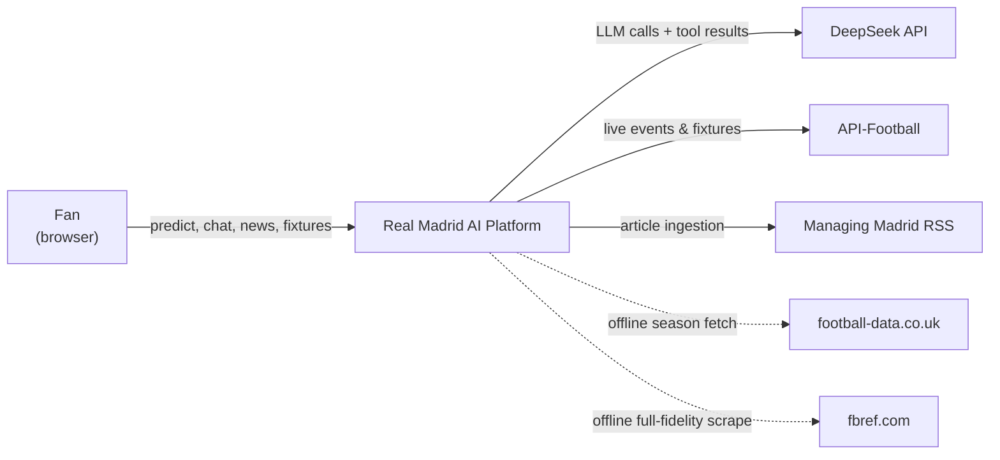
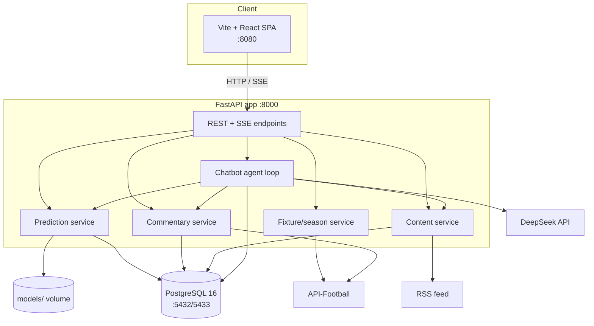
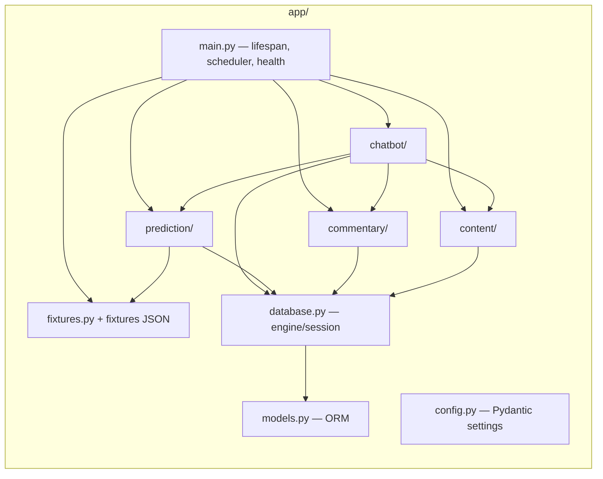
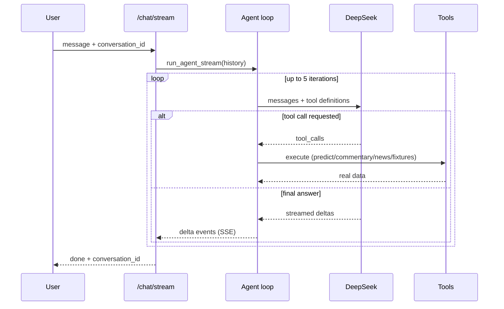
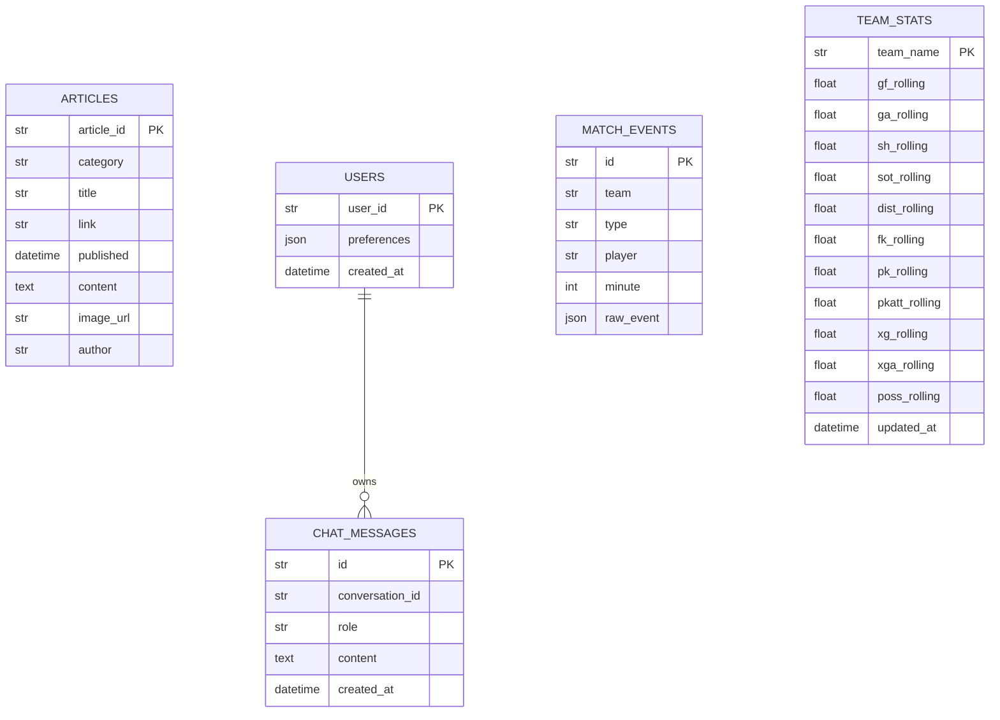
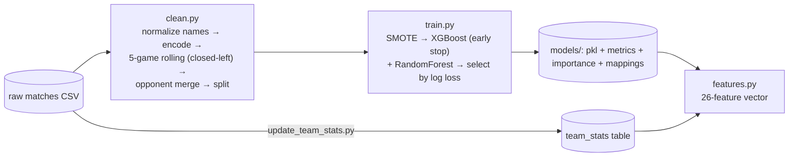
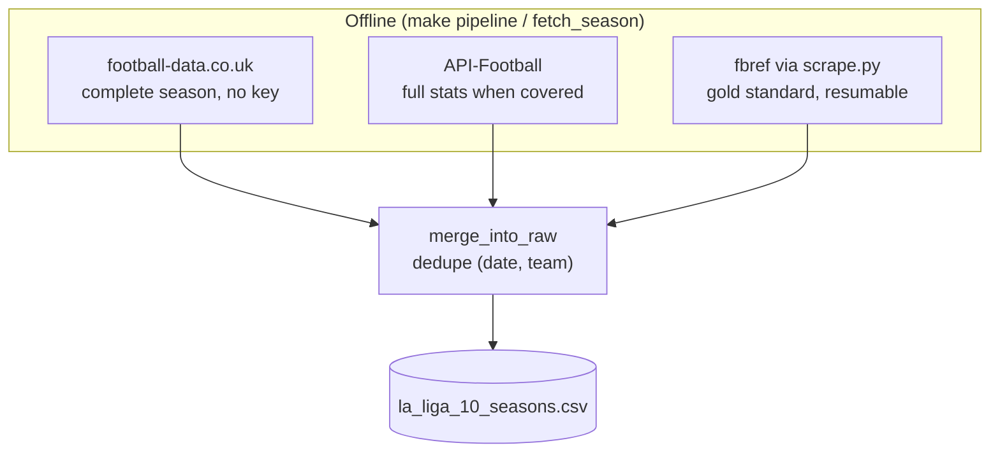
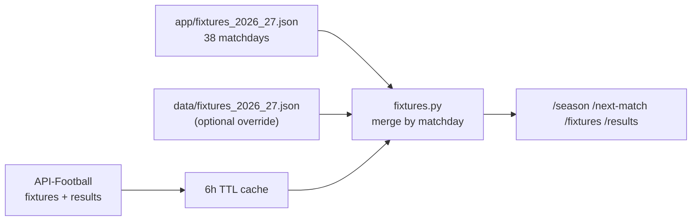
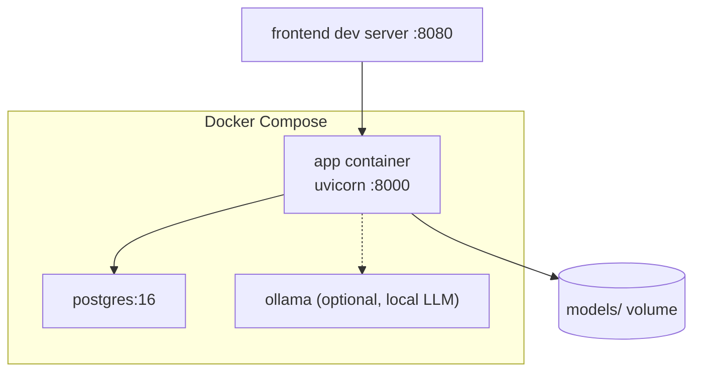

# Real Madrid AI Platform — System Design

> Architecture, data model, and operational design for the platform.
> Refreshed for the 2026/27 season: DeepSeek LLM, 26-feature model,
> full season hub, and a multi-source data pipeline.

---

## 1. System Context



**Actors**

- **Fan** — uses the SPA for predictions, chat, live commentary, news.
- **Operator** — runs the offline pipeline (`make pipeline`), monitors
  `GET /health`, retrains as seasons complete.

---

## 2. Container Diagram



**Key decisions**

- **Monolith FastAPI** with modular packages (`chatbot`, `prediction`,
  `commentary`, `content`, `fixtures`) — appropriate for a single-host
  personal platform; keeps ops trivial (one process).
- **SSE streaming** for chat (`POST /chat/stream`) — token-by-token UX without
  WebSocket complexity.
- **PostgreSQL** for match events, articles, users, chat history, and live
  team rolling stats (the prediction lookup table).

---

## 3. Backend Modules



### Chatbot agent loop



- Conversation history is persisted in `chat_messages` and replayed into the
  prompt (last 8 messages) so the agent remembers context.
- Empty LLM responses (reasoning-heavy models) trigger one retry before
  giving up — prevents blank answers.
- Provider abstraction: `DeepSeekProvider` (default), `OllamaProvider`,
  `GeminiProvider`, selected via `LLM_PROVIDER`.

---

## 4. Data Model



**Design notes**

- `team_stats` is the prediction hot-path table: one row per team with
  5-game rolling averages (11 stats). Inference does O(1) lookups.
- `chat_messages` enables conversation memory without a vector store.
- Alembic migrations are versioned (`migrations/versions/`); the app also
  calls `create_all` as a fallback for fresh installs.

---

## 5. Prediction Feature Pipeline



**The 26 features** (single source of truth: `app/prediction/features.py`):

1. Basic: `venue_code`, `opp_code`, `hour`, `day_code`
2. Real Madrid rolling (5-game): `gf`, `ga`, `sh`, `sot`, `dist`, `fk`, `pk`,
   `pkatt`, `xg`, `xga`, `poss`
3. Opponent rolling: same 11, prefixed `opp_`

Rolling windows use `closed='left'` so the current match's stats never leak
into its own features. The split is temporal (last 2 seasons = test).

**Graceful degradation** — new/promoted teams (e.g. Málaga, Oviedo) get a
stable fallback opponent code and league-average stats until their data
exists, so predictions never hard-fail.

---

## 6. Data Collection



- `fetch_season.py` fills xG/possession/etc. with league-average priors when
  the source lacks them, so downstream rolling features stay on scale.
- `scrape.py` checkpoints per team-season (`data/raw/partial/`) for resumable
  full-fidelity pulls.

---

## 7. Fixtures & Season Hub



The static schedule guarantees offline availability; API-Football enriches
kickoff times and finished-match results when the key is configured.

---

## 8. Security & Operations

- **Secrets**: `.env` is gitignored. Keys: `DEEPSEEK_API_KEY`,
  `API_FOOTBALL_KEY`, optional `GEMINI_API_KEY`.
- **LLM keys** live only server-side; the frontend never sees them.
- **Dependency hygiene**: ruff + black enforced via `make lint`; 62 pytest
  tests plus frontend vitest; CI-friendly (`make test` exits non-zero on
  failure).
- **Monitoring**: `GET /health` reports DB + LLM connectivity. Request
  middleware logs method, path, status, latency, and a request ID.
- **Scheduler** (APScheduler): RSS fetch every 6h, team-stats staleness check
  every 24h — both fail soft (logged, non-fatal).

---

## 9. Deployment



Local dev (recommended):

```bash
make setup
make dev          # backend :8000
cd frontend && npm run dev   # frontend :8080
```

Docker:

```bash
docker compose up --build
```

---

## 10. Future Work

- Full API-Football season mapping in `fetch_season.py` (when a season is
  covered there) for real xG/possession on every pulled season.
- Model calibration (temperature scaling) for sharper W/D/L probabilities.
- User auth + per-user chat history isolation.
- Historical fixtures/results page (season standings table).
