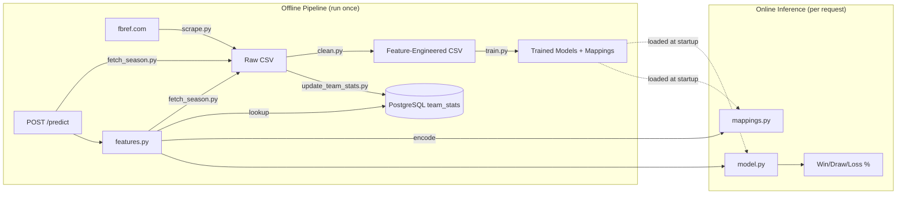
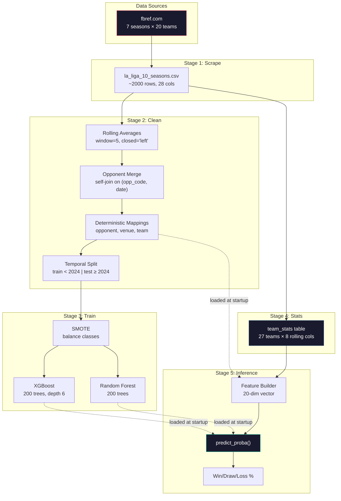

# ML Pipeline: End-to-End Documentation

> From raw web data to match outcome predictions — a complete walkthrough.

---

## Architecture Overview



---

## Step 1: Data Collection

**File:** [scrape.py](file:///Users/caephas/Downloads/side-projects/Real_Madrid_AI_Platform/pipeline/scrape.py)

**Files:** [scrape.py](file:///Users/caephas/Downloads/side-projects/Real_Madrid_AI_Platform/pipeline/scrape.py) · [fetch_season.py](file:///Users/caephas/Downloads/side-projects/Real_Madrid_AI_Platform/pipeline/fetch_season.py)

**Sources, in priority order:**

1. **[football-data.co.uk](https://www.football-data.co.uk)** — no key, works
   from any network, complete seasons. Provides results, goals, shots, and
   shots-on-target; missing advanced stats (xG, possession, shot distance,
   FK goals, penalties) are filled with league-average priors from the
   historical dataset.
2. **[fbref.com](https://fbref.com)** — the gold standard for match-level
   stats (real xG, possession, shooting). Blocked on some networks; resumable
   checkpoints make partial runs safe.
3. **API-Football** — full statistics when a season is covered by the key.

**What it scrapes:**

For every La Liga team, across ~10 seasons ending in the current year
(2017/18 → 2026/27 automatically):

| Table | Fields Extracted |
|-------|-----------------|
| Scores & Fixtures | date, venue, result, gf, ga, opponent, xg, xga, poss, formation, referee |
| Shooting | sh (shots), sot (shots on target), dist (avg shot distance), fk (free kicks), pk (penalties scored), pkatt (penalty attempts) |

**How it works:**

1. Starts at the current La Liga standings page
2. Extracts all 20 team URLs from the standings table
3. For each team: scrapes Scores & Fixtures table + Shooting stats table
4. Merges the two tables on `Date`
5. Filters to La Liga matches only (excludes Champions League, Copa del Rey)
6. Navigates to **previous season** via the "prev" link
7. Repeats until the configured end year

**Resilience:** every team-season is checkpointed to `data/raw/partial/<season>/`
as it completes, so an interrupted run resumes from where it stopped
(`--force` re-scrapes). Failed teams are logged and skipped rather than
aborting the whole run.

**Rate limiting:** fbref allows ~6 requests/minute. The scraper waits 10 seconds between requests with exponential backoff on failures (3 retries).

**Output:** `data/raw/la_liga_10_seasons.csv` — approximately 2,000+ rows with 28 columns.

**Complexity:** O(seasons × teams × 2) HTTP requests ≈ 7 × 20 × 2 = 280 requests. At 10s/req, a full scrape takes ~47 minutes.

---

## Step 2: Feature Engineering

**File:** [clean.py](file:///Users/caephas/Downloads/side-projects/Real_Madrid_AI_Platform/pipeline/clean.py)

This is the most critical step — it transforms raw match results into the **26-dimensional feature vector** the model consumes. The feature list is imported from `app/prediction/features.py`, the same module used at inference time, so training and serving can never drift.

### 2.1 Categorical Encoding

Three deterministic mappings are created by **sorting** unique values alphabetically, ensuring stable encoding across runs:

```
opponent_mapping.json: {"Alavés": 0, "Almería": 1, ..., "Villarreal": 26}
venue_mapping.json:    {"Away": 0, "Home": 1}
team_mapping.json:     {"Alavés": 0, ..., "Villarreal": 26}
```

### 2.2 Rolling Averages (Core Innovation)

For each team's match history, compute a **5-game rolling mean** of 11 stat columns:

| Stat | Rolling Column | Meaning |
|------|---------------|---------|
| gf | gf_rolling | Avg goals scored in last 5 |
| ga | ga_rolling | Avg goals conceded in last 5 |
| sh | sh_rolling | Avg shots in last 5 |
| sot | sot_rolling | Avg shots on target in last 5 |
| dist | dist_rolling | Avg shot distance in last 5 |
| fk | fk_rolling | Avg free kicks in last 5 |
| pk | pk_rolling | Avg penalties scored in last 5 |
| pkatt | pkatt_rolling | Avg penalty attempts in last 5 |
| xg | xg_rolling | Avg expected goals in last 5 |
| xga | xga_rolling | Avg expected goals against in last 5 |
| poss | poss_rolling | Avg possession % in last 5 |

> [!IMPORTANT]
> **Leakage prevention:** `closed='left'` excludes the current match row from the rolling window. Without this, the model would see information from the future (the match it's predicting).

### 2.3 Opponent Stats Merge

Each row gets enriched with the **opponent's** rolling averages. This is done via a self-join:

```
matches_rolling ⟕ matches_rolling
ON (left.opp_code = right.team_code AND left.date = right.date)
```

Result: 11 additional `opp_*_rolling` columns → **22 rolling features total**.

### 2.4 Time Features

- `hour`: kickoff hour (extracted from time column)
- `day_code`: day of week (0=Monday, 6=Sunday)

### 2.5 Target Encoding

```python
{"W": 2, "D": 1, "L": 0}
```

Three-class classification: Win, Draw, Loss.

### 2.6 Train/Test Split

**Temporal split: the last N seasons (default 2) are held out as test** (not random):

| Set | Date Range | Purpose |
|-----|-----------|---------|
| Train | All but the last 2 seasons | Model fitting (only Real Madrid rows) |
| Test | Last 2 seasons (e.g. 2024, 2025) | Evaluation (only Real Madrid rows) |

> [!IMPORTANT]
> Random splits would cause **temporal leakage** — a match in the test set could have rolling averages computed from future matches that ended up in the training set.

### 2.7 Final Feature Vector (26 dimensions)

```
[venue_code, opp_code, hour, day_code,
 gf_rolling, ga_rolling, sh_rolling, sot_rolling,
 dist_rolling, fk_rolling, pk_rolling, pkatt_rolling,
 xg_rolling, xga_rolling, poss_rolling,
 opp_gf_rolling, opp_ga_rolling, opp_sh_rolling, opp_sot_rolling,
 opp_dist_rolling, opp_fk_rolling, opp_pk_rolling, opp_pkatt_rolling,
 opp_xg_rolling, opp_xga_rolling, opp_poss_rolling]
```

**Output files:**

```
data/processed/
├── cleaned_laliga_matches.csv   # All teams, all features
├── train.csv                     # RM-only, earlier seasons
├── test.csv                      # RM-only, last 2 seasons
├── metadata.json                 # features, split info, coverage snapshot
├── opponent_mapping.json
├── venue_mapping.json
└── team_mapping.json
```

---

## Step 3: Model Training

**File:** [train.py](file:///Users/caephas/Downloads/side-projects/Real_Madrid_AI_Platform/pipeline/train.py)

### 3.1 Class Imbalance Handling

Real Madrid's class distribution is skewed (~50% wins, ~25% draws, ~25% losses). **SMOTE** (Synthetic Minority Over-sampling Technique) generates synthetic training samples for the minority classes:

```
Before SMOTE: {2: 120, 1: 55, 0: 45}  (example)
After SMOTE:  {2: 120, 1: 120, 0: 120}
```

### 3.2 Two Models Trained

| Model | Config | Strength |
|-------|--------|----------|
| **XGBoost** | 500 trees (early stopping on holdout), depth 6, learning_rate 0.08, softmax objective | Gradient boosting; captures complex interactions |
| **Random Forest** | 400 trees, min_samples_split 3 | Robust to overfitting; more stable |

Both use `random_state=42` for reproducibility.

### 3.3 Evaluation

- **Test accuracy + log loss** on the temporal holdout set
- **5-fold stratified cross-validation** on training data
- **Classification report** (precision, recall, F1 per class)
- **Feature importance** ranking (XGBoost)

The model with the **lowest test log loss** (accuracy as tiebreak) is identified
as "best" — log loss rewards well-calibrated probabilities, which matters for
W/D/L betting-style outputs more than raw accuracy. Both models are saved.

### 3.4 Outputs

```
models/
├── rf_model.pkl              # Random Forest (default at inference)
├── xgboost_model.pkl         # XGBoost (fallback)
├── model_metrics.json        # accuracy, log loss, CV, reports, provenance
├── feature_importance.json   # all 26 features ranked
├── opponent_mapping.json     # Copied from data/processed/
└── venue_mapping.json        # Copied from data/processed/
```

`model_metrics.json` records when the model was trained, the data date range,
the test seasons, and per-model metrics — handy for tracking model drift
across retrains.

---

## Step 4: Team Stats Update

**File:** [update_team_stats.py](file:///Users/caephas/Downloads/side-projects/Real_Madrid_AI_Platform/pipeline/update_team_stats.py)

Computes the **most recent** 5-game rolling averages for all 27 teams and upserts them into PostgreSQL:

```sql
CREATE TABLE team_stats (
    team_name   VARCHAR(100) PRIMARY KEY,
    gf_rolling  FLOAT, ga_rolling  FLOAT,
    sh_rolling  FLOAT, sot_rolling FLOAT,
    dist_rolling FLOAT, fk_rolling  FLOAT,
    pk_rolling  FLOAT, pkatt_rolling FLOAT,
    updated_at  TIMESTAMP WITH TIME ZONE
);
```

This table is the **bridge** between the offline pipeline and online inference. The model was trained on rolling averages, so at prediction time it needs the latest rolling averages for both RM and the opponent.

---

## Step 4.5: Automated Stats Refresh

**File:** [refresh_stats.py](file:///Users/caephas/Downloads/side-projects/Real_Madrid_AI_Platform/pipeline/refresh_stats.py)

The full pipeline (Step 1–4) takes ~47 minutes. After each La Liga matchday, only the `team_stats` rolling averages need updating — the model weights stay the same.

### How It Works

1. **Staleness check**: Is `team_stats.updated_at` older than 48 hours?
2. **If stale**: Scrape only the **current season** from fbref (~3–7 min, 20 teams × 2 requests)
3. **Merge**: Combine with existing historical data for rolling window continuity
4. **Upsert**: Compute latest 5-game rolling averages and write to PostgreSQL

### When It Runs

| Trigger | How |
|---------|-----|
| `make start` | Checks staleness before launching backend; refreshes in background if stale |
| `make refresh` | Force-refresh (always scrapes, ignores staleness) |
| App startup | APScheduler runs staleness check immediately, then every 24 hours |
| Manual | `python3 -m pipeline.refresh_stats --force` |

### Data Flow

```
After matchday:
  fbref.com (current season) → scrape → merge with historical CSV
  → compute rolling(5) per team → upsert team_stats
  → next /predict call uses fresh stats automatically
```

---

## Step 5: Online Inference

When a user clicks "Predict" on the Dashboard, this is what happens:

### 5.1 Request Flow

```
POST /predict {"opponent": "Atlético Madrid", "venue": "Home", "date": "2026-03-22"}
```

### 5.2 Feature Construction

**File:** [features.py](file:///Users/caephas/Downloads/side-projects/Real_Madrid_AI_Platform/app/prediction/features.py)

1. **Name normalization**: `_TEAM_NAME_ALIASES` maps accented names (from fixtures) to ASCII names (from fbref):
   ```python
   "Atlético Madrid" → "Atletico Madrid"
   ```

2. **Categorical encoding**: [mappings.py](file:///Users/caephas/Downloads/side-projects/Real_Madrid_AI_Platform/app/prediction/mappings.py) maps opponent name → numeric code, venue → numeric code using the same deterministic mappings from training.

3. **Rolling stats lookup**: Two queries to `team_stats` table:
   - `SELECT * FROM team_stats WHERE team_name = 'Real Madrid'` → RM's 8 rolling features
   - `SELECT * FROM team_stats WHERE team_name = 'Atletico Madrid'` → opponent's 8 rolling features

4. **Time features**: `day_code` from the date; `hour` defaults to 20 (common kickoff, low feature importance).

5. **Assembly**: All 20 features combined into a single-row DataFrame.

### 5.3 Model Prediction

**File:** [model.py](file:///Users/caephas/Downloads/side-projects/Real_Madrid_AI_Platform/app/prediction/model.py)

```python
model.predict_proba(features)  # Returns [[P(Loss), P(Draw), P(Win)]]
```

The model is loaded once at startup and cached in a module-level global.

### 5.4 Response

```json
{"win": 0.4008, "draw": 0.3688, "loss": 0.2304}
```

---

## Running the Full Pipeline

```bash
# Step 1: Scrape (~47 minutes, rate-limited)
python3 -m pipeline.scrape --output data/raw/

# Step 2: Feature engineering (~5 seconds)
python3 -m pipeline.clean --input data/raw/ --output data/processed/

# Step 3: Train models (~30 seconds)
python3 -m pipeline.train --input data/processed/ --output models/

# Step 4: Update team_stats table (~2 seconds)
python3 -m pipeline.update_team_stats

# Or all at once:
make pipeline
```

---

## Data Flow Diagram



---

## Key Design Decisions

| Decision | Rationale |
|----------|-----------|
| fbref over API-Football | Free, comprehensive historical data; no rate-limit tier issues |
| 5-game rolling window | Balances recency with stability; standard in sports analytics |
| `closed='left'` | Prevents target leakage from the current match |
| Temporal split (not random) | Prevents temporal leakage across train/test |
| SMOTE | RM wins ~50% — draws/losses are underrepresented |
| Both XGBoost + RF | Compares gradient boosting vs bagging; exports both |
| Deterministic sorted mappings | Same encoding every run regardless of data order |
| `team_stats` PostgreSQL table | Decouples offline training from online serving |
| Name alias map | Bridges accented fixture names to fbref ASCII names |

---

## File Reference

| File | Stage | Purpose |
|------|-------|---------|
| [scrape.py](file:///Users/caephas/Downloads/side-projects/Real_Madrid_AI_Platform/pipeline/scrape.py) | Offline | Scrape La Liga data from fbref.com |
| [clean.py](file:///Users/caephas/Downloads/side-projects/Real_Madrid_AI_Platform/pipeline/clean.py) | Offline | Feature engineering + train/test split |
| [train.py](file:///Users/caephas/Downloads/side-projects/Real_Madrid_AI_Platform/pipeline/train.py) | Offline | Model training + evaluation |
| [update_team_stats.py](file:///Users/caephas/Downloads/side-projects/Real_Madrid_AI_Platform/pipeline/update_team_stats.py) | Offline | Populate team_stats table |
| [model.py](file:///Users/caephas/Downloads/side-projects/Real_Madrid_AI_Platform/app/prediction/model.py) | Online | Load + cache trained model |
| [mappings.py](file:///Users/caephas/Downloads/side-projects/Real_Madrid_AI_Platform/app/prediction/mappings.py) | Online | Load + apply categorical encodings |
| [features.py](file:///Users/caephas/Downloads/side-projects/Real_Madrid_AI_Platform/app/prediction/features.py) | Online | Build 20-feature vector at inference |
| [router.py](file:///Users/caephas/Downloads/side-projects/Real_Madrid_AI_Platform/app/prediction/router.py) | Online | POST /predict endpoint |
| [fixtures.py](file:///Users/caephas/Downloads/side-projects/Real_Madrid_AI_Platform/app/fixtures.py) | Online | Static La Liga fixture schedule |
